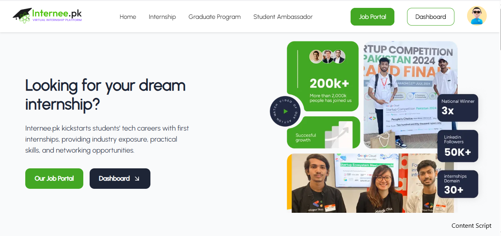

# 🌐 Internee.pk Landing Page Clone

This project is a **fully responsive clone of the landing page** of [Internee.pk](https://internee.pk), developed as part of my internship at the company. The purpose of this clone is to demonstrate front-end development proficiency, pixel-perfect replication of UI, and adherence to modern web standards.

## 🚀 About the Project

As an intern at **Internee.pk**, I took the initiative to replicate their official landing page. This task helped me understand UI/UX principles, responsive layouts, and code structuring best practices used in production-grade websites.

## 🔍 Features

- Fully responsive design across all devices
- Clean and semantic HTML5 markup
- Styled using CSS 
- Replicates layout and appearance of the original Internee.pk homepage
- Includes interactive navigation and visual enhancements

## 🛠️ Tech Stack

- HTML5  
- CSS3
- JavaScript (very Minimal)  
- Responsive Web Design techniques

## 📸 Screenshots

> 
